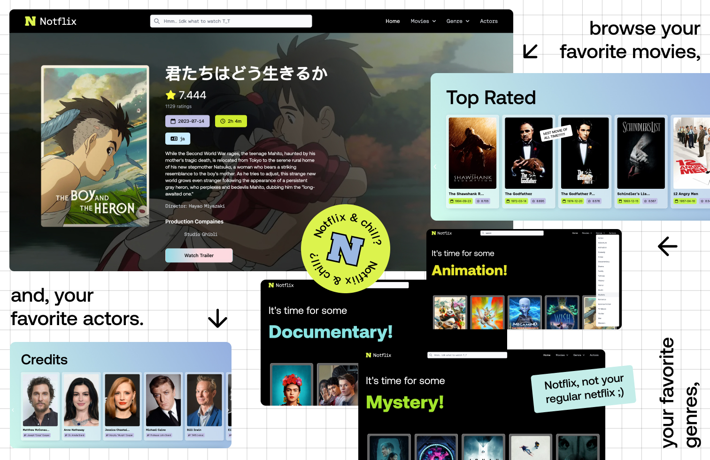

# Project Name: Notflix

**Description:**
This project is a one week team project for our Re:Coded Fullstack Web Developement Bootcamp. It's a movie browsing website where you can search & browse for movies, actors, genres, and showcasing the latest and most popular movies. The website design is sleek, intuitive, and responsive, ensuring accessibility across different devices and screen sizes.

> _We wanted to make something that we would like to visit ourselves, everytime we get lost in the realm of movies and we don't know what to watch, and I think I definitely will use it myself whenever I'm looking to find a movie to watch._

**Tools Used:**

_Technical:_

- HTML5
- CSS3
- JavaScript
- React
- NextJS

_Others:_

- Discord
- Notion
- Figma
- tldraw

**Contributors:**

1. Rawan Mustafa [Github](https://github.com/0Rawan)
2. Sarah Mustafa [Github](https://github.com/Leorahx)
3. Pasand Yaba
4. Hiwa Sadradeen

---

Feel free to explore the website and get in touch with any feedback or inquiries!
